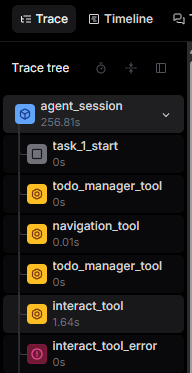
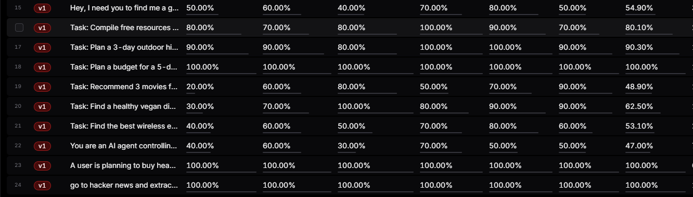
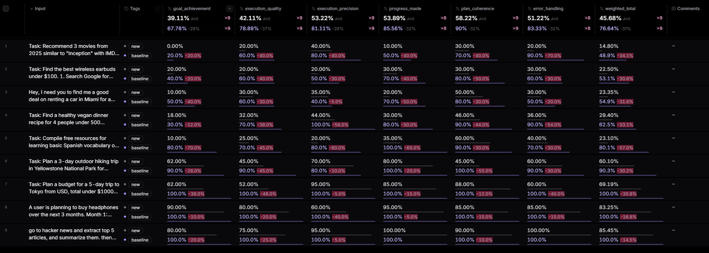
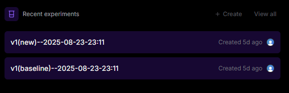

# Evals Knowledge Transfer

## Table of Contents
1. [What are evals? (Offline vs. Online)](#what-are-evals-offline-vs-online)
2. [Why Braintrust?](#why-braintrust)
3. [Code Outline](#code-outline)
4. [How it works (Architecture Overview)](#how-it-works-architecture-overview)
5. [How to begin logging & tagging](#how-to-begin-logging--tagging)
6. [How to Experiment with Prompt/Agent Changes](#how-to-experiment-with-promptagent-changes)


---

## What are evals? (Offline vs. Online)

**Evals** are measurements of agent performance against given tasks. They help us iterate, quantify improvements, and detect regressions.

- **Offline evals**:
  - Iterations using a fixed dataset of inputs/scores
  - Previous implementation ideas included unit, integration, e2e testing
- **Online evals**:
  - Collected automatically while you run the agent during development
  - Leverages tracing, real e2e data

I concluded to use development-only **online** evals for this project because we can capture real, end‑to‑end behavior. While offline evals were the initial plan for a foundation, I have found it not useful as we do not want to mock our agent execution/context.


## Why Braintrust?

Braintrust gives us:
- **Visualizing Agent Tool calls** with timeline
  

- **Visualization & Management of agent logs** for identifying/tagging datasets  
  

- **Side‑by‑side experiment comparisons** (baseline vs. new) with diffs and scores  
  

- **Storage of experiments** to compare iterations of experiments  
  


## Code Outline
```
src/
├─ evals/
│  ├─ BraintrustEventCollector.ts   # class for traces and logging utilizing braintrust
│  ├─ ExperimentRunner.ts           # class for running an experiment utilizing braintrust
│  ├─ tool-wrapper.ts               # wrapper for tools for simple timing/metrics/errors (allows for viewing tools in braintrust logs)
│  └─ scoring/
│     ├─ LLMJudge.ts                # Multi‑dimensional scoring engine
│     ├─ LLMJudge.prompts.ts        # Scoring criteria/prompts
│     └─ scoring-openai.ts          # OpenAI client for scoring
│
├─ background/index.ts              
├─ sidepanel/components/
│  ├─ ExperimentModal.tsx           # UI modal for experiments
│  └─ Header.tsx                    # Where Beaker button is located when enabled
│
└─ lib/
   ├─ core/NxtScape.ts              # where we implement BraintrustEventCollector.ts
   ├─ agent/BrowserAgent.ts         # where we add the auto‑wrapped tool calls
```

## How it works (Architecture Overview)

Two modes:

1) **Passive Logging Mode** *(default when `ENABLE_TELEMETRY=true`)*
   - Logs every run to Braintrust and attaches LLM scores.
   - Builds your dataset for future experiments.

2) **Active Experimentation Mode** *(triggered by the beaker button)*
   - Fetches tagged logs (baseline) → replays with your **current** code.
   - Logs *once* to both Logs and the **Experiments** (dual logging; no duplicate scoring).
   - Allows for side‑by‑side comparisons in Braintrust.

**Clean isolation per test:** each experiment test clears Chrome storage, resets singletons, and reopens a fresh tab to avoid cross‑test contamination.


---
## How to begin logging & tagging

### 1) Configure keys (`src/config.ts`)
```ts
export const ENABLE_TELEMETRY = true                    // ⚠️ Dev‑only logging + shows experiment button
export const BRAINTRUST_API_KEY = 'sk-...'             // Required for telemetry & experiments
export const OPENAI_API_KEY_FOR_SCORING = 'sk-...'     // For LLM Judge scoring
export const OPENAI_MODEL_FOR_SCORING = 'gpt-5'        // gpt-5 | gpt-5-mini | gpt-5-nano
```

### 2) Build & load the Chrome extension
```bash
npm run build:dev
# Then load the /dist folder at chrome://extensions (Developer Mode → Load unpacked)
```

### 3) Generate logs in **Passive Logging Mode**
- Open the side panel and use the agent on a few representative tasks.
- Each run is automatically logged to Braintrust with scores.

### 4) **Tag** interesting logs in Braintrust
- Go to the Braintrust dashboard → your project.
- Tag a good baseline set, e.g., `v1`.


## How to Experiment with Prompt/Agent Changes
#### Configure UUID (`src/config.ts`)
```ts
export const BRAINTRUST_PROJECT_UUID = '49768a1a-...'  // Your Braintrust project UUID
```

1. **Pick a baseline**: In Braintrust, tag a representative set of dev logs (e.g., `v1`). (*Noted in Video 1*)
2. **Change prompts/logic locally**:
   - Main agent/system prompts: `BrowserAgent.prompt.ts`
   - Planning: `PlannerTool.prompt.ts`
   - Classification/routing: `ClassificationTool.prompt.ts`
   - Agent logic: `BrowserAgent.ts`, tool implementations, etc.
3. **Rebuild the extension**: `npm run build:dev` → reload in Chrome.
4. **Run experiment** selecting a **Logs Tag** (`v1`) in the agent extension (ensure you made agent changes before starting).
5. **Compare** in Braintrust (*Noted in video 2*):
   - Side‑by‑side diffs of outputs.
   - Multi‑dimensional score (goal achievement, precision, etc.).
   - Success‑rate changes across tasks.
6. **Iterate**: Address regressions, keep improvements, re‑run until satisfied.

*Note:* Experiment runs use your **current local code**. If you didn’t change anything, v2 ≈ v1.

*Consider:* Experiment runs do not need to be solely for prompt changes - incorporate new tools easily, compare new models, etc. Also consider making it a production feature, users can maybe evaluate the custom agents they make. There can be privacy warnings but they can use their own api/braintrust so the data should be isolated as the agent is

---


